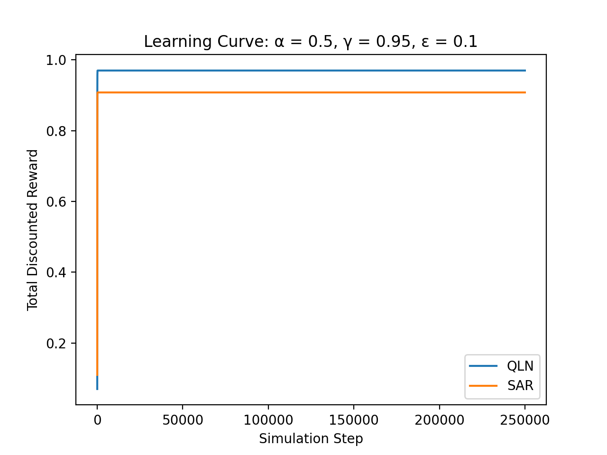
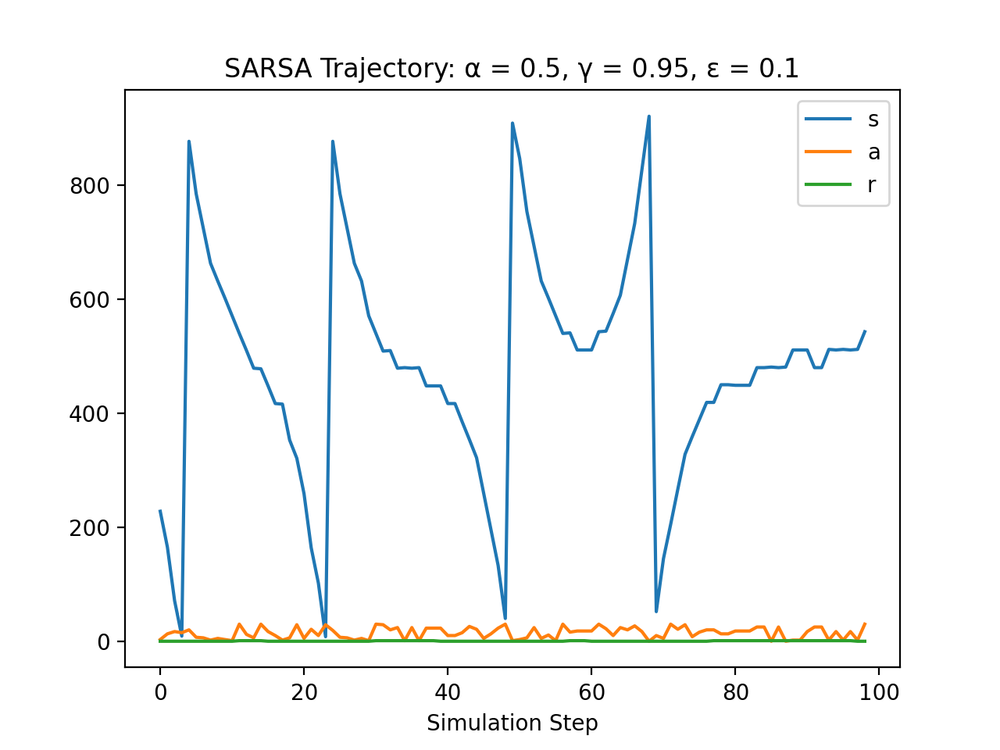
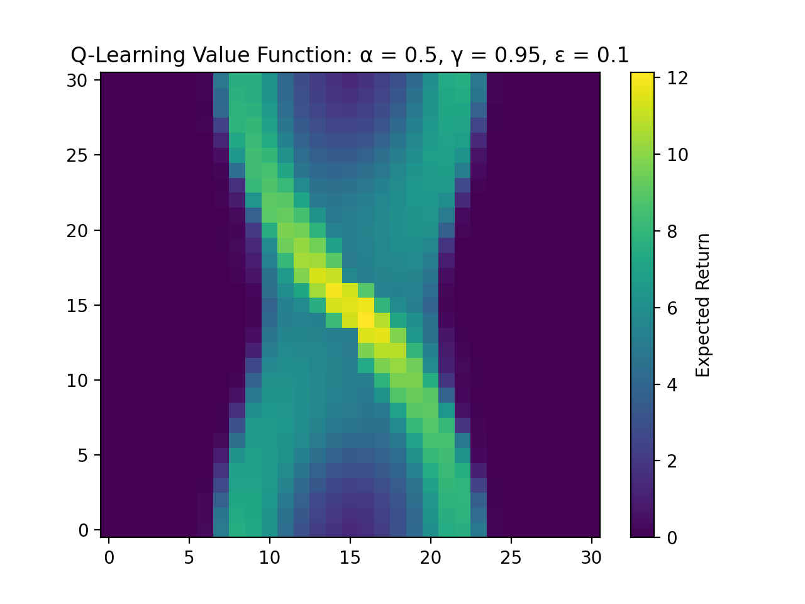

# RL Agents for Python
_Grayson Schaer\
09/01/2020_

# Usage
Included are four reinforcement learning classes: `Policy_Iteration_Agent.py`, `Value_Iteration_Agent.py`, `SARSA_Agent.py`, and `QLearning_Agent.py`. These classes implement the policy iteration, value iteration, SARSA, and Q-learning algorithms, respectively. Also included are two testing environments, `Gridworld_Test_Env.py` and `Pendulum_Test_Env.py`. `Gridworld_Test_Env.py` provides a simulation environment of the classical gridworld. The states are defined as indices in the gridworld, the actions are directions of travel, and the reward is based on hitting or missing a reward/teleport tile. `Pendulum_Test_Env.py` provides a simulation environment of a single pendulum with discretized states and actions. The states are related to the angular position and angular rate of the pendulum, the actions are related to the applied torque at the fulcrum of the pendulum, and the rewards are proportional to how close the pendulum is to standing upright. Usage of the learning classes is demonstrated in the test scripts, `Gridworld_Test.py` and `Pendulum_Test.py`.

## `Policy_Iteration_Agent.py` Usage
```Python
import Gridworld_Test_Env as gte
import Policy_Iteration_Agent as pa

# Initialize the testing environment
env = gte.GridWorld()
n_episodes = 10

# Gather data from the environment
num_states = env.num_states
num_actions = env.num_actions
num_rows = int(math.sqrt(n_s)) #This defines the size of the x direction of the planar state-space
num_cols = n_rows #This defines the size of the y direction of the planar state-space

# Define other agent parameters
gamma = 0.95 # Discount rate

# Create and train agent (Training is done before simulation because this is a model based agent)
p_agent = pa.Policy_Iteration_Agent(num_states, num_actions, num_rows, num_cols, gamma, env)
p_agent.train() # This will save the training curve as a .png

# Simulate agent over n_episodes of episodes
    for curr_episode in range(n_episodes):

        # Initialize simulation environment
        s1 = env.reset()
        a1 = p_agent.get_action(s1)

        # Simulate until episode is done
        done = False
        while not done:

            # Do the selected action and get a new action
            (s2, r, done) = env.step(a1)
            a2 = p_agent.get_action(s2)

            # Update state and action
            s1 = s2
            a1 = a2

        # After an episode is done, update the logbook
        p_agent.end_episode()

    # Once an episode set is complete, update the logbook and terminate the current log
    p_agent.terminate_agent()

# Gather the results from the test in the logbook
results = p_agent.logbook
```

## `Value_Iteration_Agent.py` Usage
```Python
import Gridworld_Test_Env as gte
import Value_Iteration_Agent as va

# Initialize the testing environment
env = gte.GridWorld()
n_episodes = 10

# Gather data from the environment
num_states = env.num_states
num_actions = env.num_actions
num_rows = int(math.sqrt(n_s)) #This defines the size of the x direction of the planar state-space
num_cols = n_rows #This defines the size of the y direction of the planar state-space

# Define other agent parameters
gamma = 0.95 # Discount rate

# Create and train agent (Training is done before simulation because this is a model based agent)
v_agent = va.Value_Iteration_Agent(num_states, num_actions, num_rows, num_cols, gamma, env)
v_agent.train() # This will save the training curve as a .png

# Simulate agent over n_episodes of episodes
    for curr_episode in range(n_episodes):

        # Initialize simulation environment
        s1 = env.reset()
        a1 = v_agent.get_action(s1)

        # Simulate until episode is done
        done = False
        while not done:

            # Do the selected action and get a new action
            (s2, r, done) = env.step(a1)
            a2 = v_agent.get_action(s2)

            # Update state and action
            s1 = s2
            a1 = a2

        # After an episode is done, update the logbook
        v_agent.end_episode()

    # Once an episode set is complete, update the logbook and terminate the current log
    v_agent.terminate_agent()

# Gather the results from the test in the logbook
results = v_agent.logbook
```
## `SARSA_Agent.py` Usage
```Python
import Gridworld_Test_Env as gte
import SARSA_Agent as sa

# Initialize the testing environment
env = gte.GridWorld()
n_episodes = 10

# Gather data from the environment
num_states = env.num_states
num_actions = env.num_actions
num_rows = int(math.sqrt(n_s)) #This defines the size of the x direction of the planar state-space
num_cols = n_rows #This defines the size of the y direction of the planar state-space

# Define other agent parameters
alpha = 0.50 # Learning rate
gamma = 0.95 # Discount rate
epsilon = 0.10 # Exploration rate

# Create agent
s_agent = sa.SARSA_Agent(num_states, num_actions, num_rows, num_cols, alpha, gamma, epsilon, env)

# Train agent over n_episodes of episodes
for curr_episode in range(n_episodes):

    # Initialize simulation
    s1 = env.reset()
    a1 = random.randint(0, env.num_actions - 1)

    # Simulate until episode is done
    done = False
    while not done:

        # Do the selected action and get a new action
        (s2, r, done) = env.step(a1)
        a2 = s_agent.get_action(s2)

        # Update agent's Q estimate
        s_agent.update_Q(s1, a1, s2, a2, r)

        # Update state and action
        s1 = s2
        a1 = a2

    # After an episode is done, update the logbook
    s_agent.end_episode()

# Once an episode set is complete, update the logbook and terminate the current log
s_agent.terminate_agent()

# Gather the results from the test in the logbook
results = s_agent.logbook
```
## `QLearning_Agent.py` Usage
```Python
import Gridworld_Test_Env as gte
import QLearning_Agent as qa

# Initialize the testing environment
env = gte.GridWorld()
n_episodes = 10

# Gather data from the environment
num_states = env.num_states
num_actions = env.num_actions
num_rows = int(math.sqrt(n_s)) #This defines the size of the x direction of the planar state-space
num_cols = n_rows #This defines the size of the y direction of the planar state-space

# Define other agent parameters
alpha = 0.50 # Learning rate
gamma = 0.95 # Discount rate
epsilon = 0.10 # Exploration rate

# Create agent
q_agent = qa.QLearn_Agent(num_states, num_actions, num_rows, num_cols, alpha, gamma, epsilon, env)

# Train agent over n_episodes of episodes
for curr_episode in range(n_episodes):

    # Initialize simulation
    s1 = env.reset()

    # Simulate until episode is done
    done = False
    while not done:

        # Do the selected action and get a new action
        a1 = q_agent.get_action(s1)
        (s2, r, done) = env.step(a1)

        # Update agent's Q estimate
        q_agent.update_Q(s1, a1, s2, r)

        # Update state and action
        s1 = s2

    # After an episode is done, update the logbook
    q_agent.end_episode()

# Once an episode set is complete, update the logbook and terminate the current log
q_agent.terminate_agent()

# Gather the results from the test in the logbook
results = q_agent.logbook
```
# Gridworld Example Results

## Learning curves
_This section contains the learning curves for all algorithms used in Gridworld._


<div style="text-align: center"> <b>Figure 1:</b> Graphical visualization of the average discounted reward curves for the policy iteration, value iteration, SARSA, and Q-learning algorithms in the gridworld environment. Each training event occurred over 300, 100 step long episodes. Curves were averaged over 250 training events.</div><br /><br />


<div style="text-align: center"> <b>Figure 2:</b> Graphical visualization of the average reward curves for the policy iteration, value iteration, SARSA, and Q-learning algorithms in the gridworld environment. Each training event occurred over 300, 100 step long episodes. Curves were averaged over 250 training events.</div><br /><br />


<div style="text-align: center"> <b>Figure 3:</b> Graphical visualization of the learning curve for the policy iteration algorithm, whose simulation performance was shown in <b>Figure 1</b> and <b>Figure 2</b>, as a function of the training steps (iteration). Here an iteration is defined as any singular step taken during the policy evaluation (k = 50) or policy improvement phases. Training continued until policy stability was achieved.</div><br /><br />


<div style="text-align: center"> <b>Figure 4:</b> Graphical visualization of the learning curve for the value iteration algorithm, whose simulation performance was shown in <b>Figure 1</b> and <b>Figure 2</b>, as a function of the training steps (iteration). Here an iteration is defined as any singular step taken during the policy evaluation (k = 1) or policy improvement phases. Training continued until the value function was stabilized.</div><br /><br />


<div style="text-align: center"> <b>Figure 5:</b> Graphical visualization of the learning curve for the SARSA and Q-Learning agents, whose simulation performance was shown in <b>Figure 1</b> and <b>Figure 2</b>, as a function of the simulation steps. Simulation continued until policy stability was achieved. Results were averaged over 100 agents.</div><br /><br />

## Policy Iteration
_This section contains an example trajectory for the policy iteration algorithm executed in Gridworld as well as visualizations of its policy function TD(0) estimated value function._


<div style="text-align: center"> <b>Figure 6:</b> Best trajectory created during a single episode of a policy iteration agent in the gridworld environment.</div><br /><br />


<div style="text-align: center"> <b>Figure 7:</b> Visualization of the policy created by the policy iteration agent in the gridworld environment. Here each color represents an action (0 -> right, 1 - > up, 2 - > left, 3 -> down) and each tile represents one of the 25 discrete states.</div><br /><br />


<div style="text-align: center"> <b>Figure 8:</b> Visualization of the value function created during the policy iteration agent's training. Each gridspace represents the actual location of a state in gridworld. The quantity in each gridspace represents estimated total discounted reward (return) of the associated state.</div><br /><br />

## Value Iteration
_This section contains an example trajectory for the value iteration algorithm executed in Gridworld as well as visualizations of its policy function TD(0) estimated value function._


<div style="text-align: center"> <b>Figure 9:</b> Best trajectory created during a single episode of a value iteration agent in the gridworld environment.</div><br /><br />


<div style="text-align: center"> <b>Figure 10:</b> Visualization of the policy created by the value iteration agent in the gridworld environment. Here each color represents an action (0 -> right, 1 - > up, 2 - > left, 3 -> down) and each tile represents one of the 25 discrete states.</div><br /><br />


<div style="text-align: center"> <b>Figure 11:</b> Visualization of the value function created during the value iteration agent's training. Each gridspace represents the actual location of a state in gridworld. The quantity in each gridspace represents estimated total discounted reward (return) of the associated state.</div><br /><br />

## SARSA
_This section contains an example trajectory for the SARSA algorithm executed in Gridworld, learning curves for different values of &#949; learning curves for different values of 	&#945;, and visualizations of its policy function TD(0) estimated value function._


<div style="text-align: center"> <b>Figure 12:</b> Best trajectory created during a single episode of a SARSA agent in the gridworld environment.</div><br /><br />


<div style="text-align: center"> <b>Figure 13:</b> Visualization of the policy created by the SARSA agent in the gridworld environment. Here each color represents an action (0 -> right, 1 - > up, 2 - > left, 3 -> down) and each tile represents one of the 25 discrete states. Colors are continuous because the policy is probabilistic based on the average policy generated by all 100 trained agents. In this scheme, a color value of 2.5 denotes a 50% chance of traveling left and a 50% change of traveling down. </div><br /><br />


<div style="text-align: center"> <b>Figure 14:</b> Visualization of the value function created during the SARSA agent's simulation by the TD(0) algorithm. Each gridspace represents the actual location of a state in gridworld. The quantity in each gridspace represents estimated total discounted reward (return) of the associated state.</div><br /><br />


<div style="text-align: center"> <b>Figure 15:</b> Graphical representation of the SARSA agent's learning curve dependency on the value of &#945 in gridworld. Each training event occurred over 10, 100 step long episodes. Curves were averaged over 250 training events.</div><br /><br />


<div style="text-align: center"> <b>Figure 16:</b> Graphical representation of the SARSA agent's learning curve dependency on the value of &#949 in gridworld. Each training event occurred over 10, 100 step long episodes. Curves were averaged over 250 training events.</div><br /><br />

## Q-Learning
_This section contains an example trajectory for the Q-Learning algorithm executed in Gridworld, learning curves for different values of &#949; learning curves for different values of 	&#945;, and visualizations of its policy function TD(0) estimated value function._


<div style="text-align: center"> <b>Figure 17:</b> Best trajectory created during a single episode of a Q-Learning agent in the gridworld environment.</div><br /><br />


<div style="text-align: center"> <b>Figure 18:</b> Visualization of the policy created by the Q-Learning agent in the gridworld environment. Here each color represents an action (0 -> right, 1 - > up, 2 - > left, 3 -> down) and each tile represents one of the 25 discrete states. Colors are continuous because the policy is probabilistic based on the average policy generated by all 100 trained agents. In this scheme, a color value of 2.5 denotes a 50% chance of traveling left and a 50% change of traveling down. </div><br /><br />


<div style="text-align: center"> <b>Figure 19:</b> Visualization of the value function created during the Q-Learning agent's simulation by the TD(0) algorithm. Each gridspace represents the actual location of a state in gridworld. The quantity in each gridspace represents estimated total discounted reward (return) of the associated state.</div><br /><br />


<div style="text-align: center"> <b>Figure 20:</b> Graphical representation of the Q-Learning agent's learning curve dependency on the value of &#945 in gridworld. Each training event occurred over 10, 100 step long episodes. Curves were averaged over 250 training events.</div><br /><br />


<div style="text-align: center"> <b>Figure 21:</b> Graphical representation of the Q-Learning agent's learning curve dependency on the value of &#949 in gridworld. Each training event occurred over 10, 100 step long episodes. Curves were averaged over 250 training events.</div><br /><br />

## Gridworld Conclusions
_This sections contains discussion of the conclusions that can be drawn based on the previous sections' data._

Four learning algorithms and one value function estimation algorithm were simulated in a gridworld environment (all with γ = 0.95). Among these algorithms were two model based reinforcement agents, policy iteration and value iteration, and two model free reinforcement agents, SARSA and Q-learning. As expected, it is apparent from <b>Figure 1</b> and <b>Figure 2</b> that the model based agents performed better on average. This is because they have no need to explore the environment, a costly maneuver, during the simulation. Instead, they are fed a model before simulation to automatically determine an optimal policy. Furthermore, in this simulation, the policy iteration and value iteration agents performed approximately the same; however the value iteration agent ran approximately 10 times faster than the policy iteration agent (~0.05 seconds compared to ~0.5 seconds). This is due to the significant reduction in calculation incurred from transformation of the policy evaluation step between the policy iteration and value iteration algorithms.

The first ~15000 steps for the SARSA and Q-learning algorithms represent their learning periods as denoted by the initial infinite slope decreasing with simulation step until a constant is reached in <b>Figure 5</b>. Also note the constant slope seen in <b>Figure 1</b> is approximately 10% lower than those of the policy iteration and value iteration results due to the epsilon-greedy algorithm constant of 0.10 for the SARSA and Q-learning agents. The performance of both of these agents is comparable due to the exceptionally small state and action space of the problem. A Q-learning agent is expected to converge to the optimal policy slightly faster than a SARSA agent given a sufficient quantity of states and actions. This is because q-learning is an off-policy algorithm while SARSA is an on-policy algorithm.

The dependency of SARSA and Q-learning on alpha and epsilon in gridworld was also characterized in this section. On average, the optimal learning rate (alpha) was approximately 0.40 for both algorithms and variation from this value led to a generally lower reward rate. Essentially this means that new information about the quality function gathered during exploration is weighted approximately 20% lower than the previous estimation during averaging. Furthermore, on average the optimal exploration rate (epsilon) was approximately 0.02 for both algorithms and variation from this value led to a generally lower reward rate. Neither of these values seemed to have a significant impact on the amount of time taken to achieve a steady rate of reward (likely again due to the relatively small state and action space).

# Discrete Pendulum Example Results

## Learning curves
_This section contains the learning curves for all algorithms used with the Discrete Pendulum._


<div style="text-align: center"> <b>Figure 22:</b> Graphical visualization of the average discounted reward curves for the SARSA and Q-learning algorithms in the pendulum environment. Each training event occurred over 1500, 100 step long episodes. Curves were averaged over 100 training events.</div><br /><br />


<div style="text-align: center"> <b>Figure 23:</b> Graphical visualization of the average reward curves for the SARSA and Q-learning algorithms in the pendulum environment. Each training event occurred over 1500, 100 step long episodes. Curves were averaged over 100 training events.</div><br /><br />


<div style="text-align: center"> <b>Figure 24:</b> Graphical visualization of the learning curve for the SARSA and Q-Learning agents, whose simulation performance was shown in <b>Figure 22</b> and <b>Figure 23</b>, as a function of the simulation steps. Simulation continued until policy stability was achieved. Results were averaged over 100 agents.</div><br /><br />

## SARSA
_This section contains an example trajectory for the SARSA algorithm executed in the Discrete Pendulum, learning curves for different values of &#949; learning curves for different values of 	&#945;, and visualizations of its policy function TD(0) estimated value function._


<div style="text-align: center"> <b>Figure 25:</b> Best trajectory created during a single episode of a SARSA agent in the pendulum environment.</div><br /><br />


<div style="text-align: center"> <b>Figure 26:</b> Visualization of the policy created by the SARSA agent in the pendulum environment. Here each color represents an action in the action space, the x-axis represents the discrete pendulum angles, and the y-axis represents the discrete pendulum angular rates. Colors are continuous because the policy is probabilistic based on the average policy generated by all 100 trained agents. In this scheme, a color value of 10.5 denotes a 50% chance of executing action 10 and a 50% chance of executing action 11. </div><br /><br />


<div style="text-align: center"> <b>Figure 27:</b> Visualization of the value function created during the SARSA agent's simulation by the TD(0) algorithm. The x-axis represents the discrete pendulum angles, and the y-axis represents the discrete pendulum angular rates. The quantity in each tile represents estimated total discounted reward (return) of the associated state.</div><br /><br />


<div style="text-align: center"> <b>Figure 28:</b> Graphical representation of the SARSA agent's learning curve dependency on the value of &#945 in the pendulum environment. Each training event occurred over 700, 100 step long episodes. Curves were averaged over 250 training events.</div><br /><br />


<div style="text-align: center"> <b>Figure 29:</b> Graphical representation of the SARSA agent's learning curve dependency on the value of &#949 in the pendulum environment. Each training event occurred over 700, 100 step long episodes. Curves were averaged over 250 training events.</div><br /><br />

## Q-Learning
_This section contains an example trajectory for the Q-Learning algorithm executed in the Discrete Pendulum, learning curves for different values of &#949; learning curves for different values of 	&#945;, and visualizations of its policy function TD(0) estimated value function._


<div style="text-align: center"> <b>Figure 30:</b> Best trajectory created during a single episode of a Q-Learning agent in the pendulum environment.</div><br /><br />


<div style="text-align: center"> <b>Figure 31:</b> Visualization of the policy created by the Q-Learning agent in the pendulum environment. Here each color represents an action in the action space, the x-axis represents the discrete pendulum angles, and the y-axis represents the discrete pendulum angular rates. Colors are continuous because the policy is probabilistic based on the average policy generated by all 100 trained agents. In this scheme, a color value of 10.5 denotes a 50% chance of executing action 10 and a 50% chance of executing action 11. </div><br /><br />


<div style="text-align: center"> <b>Figure 32:</b> Visualization of the value function created during the Q-Learning agent's simulation by the TD(0) algorithm. The x-axis represents the discrete pendulum angles, and the y-axis represents the discrete pendulum angular rates. The quantity in each tile represents estimated total discounted reward (return) of the associated state.</div><br /><br />


<div style="text-align: center"> <b>Figure 33:</b> Graphical representation of the Q-Learning agent's learning curve dependency on the value of &#945 in the pendulum environment. Each training event occurred over 700, 100 step long episodes. Curves were averaged over 250 training events.</div><br /><br />


<div style="text-align: center"> <b>Figure 34:</b> Graphical representation of the Q-Learning agent's learning curve dependency on the value of &#949 in the pendulum environment. Each training event occurred over 700, 100 step long episodes. Curves were averaged over 250 training events.</div><br /><br />

## Pendulum Conclusions
_This sections contains discussion of the conclusions that can be drawn based on the previous sections' data._

Two model free learning algorithms, SARSA and Q-learning, were implemented to control a discrete state and action space pendulum (both with γ = 0.95). In this case, the pendulum has 31 discrete angles and 31 discrete angular rates for a total of 961 states and 31 discrete input torques for a total of 31 states. The reward on this system is proportional to how close the pendulum is to the 0 angle with 0 angular rate.

Based on the overlayed learning curves shown in <b>Figure 22</b>, <b>Figure 23</b>, and <b>Figure 24</b>, the Q-learning algorithm performs better than the SARSA algorithm. This is expected because the Q-learning algorithm directly estimates the optimal quality function (off-policy learning) while SARSA estimates only the current quality function (on-policy learning). The difference between these two curves is larger than that seen in the gridworld environment due to the order of magnitude increase in the total number of both states and actions.

The dependency of SARSA and Q-learning on alpha and epsilon on the discrete pendulum was also characterized in this section. On average, the optimal learning rate (alpha) was approximately 0.40 for both algorithms and variation from this value led to a lower steady reward rate and a longer initial learning period. This makes sense as too aggressive values of alpha means that the agent has essentially no memory, yet too low values of alpha means the agent cannot learn new information. Furthermore, on average the optimal exploration rate (epsilon) was approximately 0.04 for both algorithms and variation from this value led to a generally lower reward rate. This optimal exploration rate is higher than that in gridworld because there is a significantly larger state and action space in the discrete pendulum environment. This means that more exploration is required to find optimal actions.

# License
MIT License

Copyright (c) 2020 Grayson Schaer

Permission is hereby granted, free of charge, to any person obtaining a copy
of this software and associated documentation files (the "Software"), to deal
in the Software without restriction, including without limitation the rights
to use, copy, modify, merge, publish, distribute, sublicense, and/or sell
copies of the Software, and to permit persons to whom the Software is
furnished to do so, subject to the following conditions:

The above copyright notice and this permission notice shall be included in all
copies or substantial portions of the Software.

THE SOFTWARE IS PROVIDED "AS IS", WITHOUT WARRANTY OF ANY KIND, EXPRESS OR
IMPLIED, INCLUDING BUT NOT LIMITED TO THE WARRANTIES OF MERCHANTABILITY,
FITNESS FOR A PARTICULAR PURPOSE AND NONINFRINGEMENT. IN NO EVENT SHALL THE
AUTHORS OR COPYRIGHT HOLDERS BE LIABLE FOR ANY CLAIM, DAMAGES OR OTHER
LIABILITY, WHETHER IN AN ACTION OF CONTRACT, TORT OR OTHERWISE, ARISING FROM,
OUT OF OR IN CONNECTION WITH THE SOFTWARE OR THE USE OR OTHER DEALINGS IN THE
SOFTWARE.
